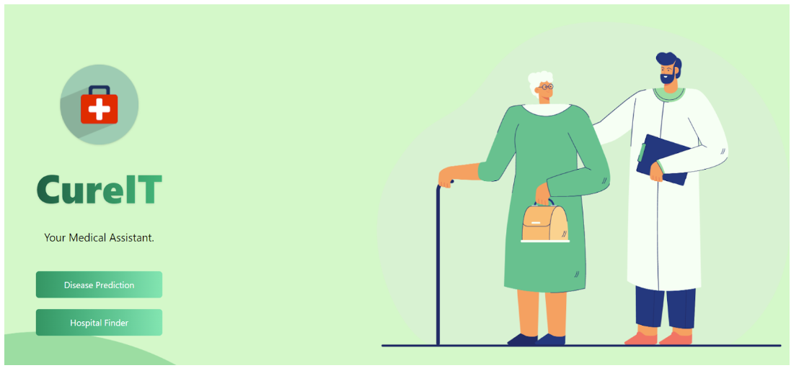

<h1 align="center">CURE-IT 👨‍⚕️</h1>

    <a href="https://tarp-proj.vercel.app/">View Website</a>

CureIt is a device which can be used to collect symptoms from the patient and predict the disease. It will also help patients to book an appointment based on their disease severity. We have used Support Vector Classifier from the sklearn library in Python to create Hyperplanes to classify a disease based on the symptoms.

## Technologies Used

* 19BLC1012 KPS SHIVRATNA
